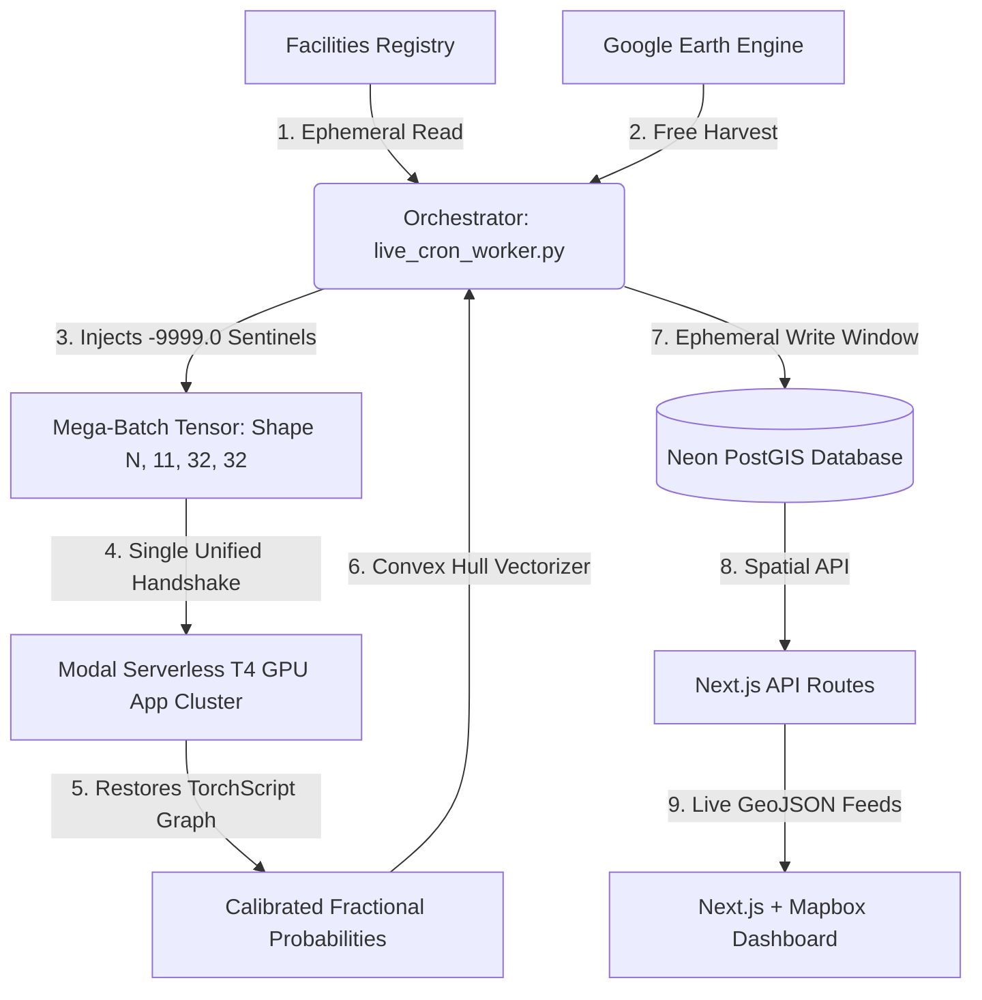

# MethaneLeak

A live geospatial MLOps pipeline for detecting and visualizing 
methane emission anomalies over Uzbekistan's gas infrastructure.
Built as an end-to-end system — from satellite data ingestion 
to a public interactive dashboard.

**Live dashboard:** https://methane-leak.vercel.app

---

## What It Does

Uzbekistan sits on significant natural gas reserves. Methane 
leaks from pipelines, compressor stations, and processing 
facilities are both an environmental problem and an economic 
loss — but most go undetected because continuous monitoring 
is expensive.

This platform uses free satellite data (Sentinel-5P TROPOMI) 
and open infrastructure registries (OGIM) to run daily 
automated anomaly detection across 82 gas facilities. 
Confirmed anomalies are stored as geospatial polygons in a 
PostGIS database and rendered on a live Mapbox dashboard.

---

## System Architecture



---

## How It Works

### Data Pipeline

Every day at 02:00 UTC, a GitHub Actions workflow triggers 
the main orchestrator. It pulls the latest Sentinel-5P TROPOMI 
methane readings and ERA5 wind vectors for all 82 facilities 
via Google Earth Engine — completely free.

Rather than making separate API calls per facility per date, 
the orchestrator stacks everything into a single batch tensor 
of shape (N, 11, 32, 32) and sends it to the GPU in one 
request. This keeps cloud compute costs near zero.

Missing data (delayed ERA5 grids, cloud-contaminated TROPOMI 
pixels) is handled by injecting -9999.0 sentinel values that 
map cleanly to NaN inside the model.

### ML Model

The inference model implements the AutoMergeNet architecture 
from Wąsala et al. (2025) — an AutoML-discovered multi-branch 
CNN that outperformed transformer-based alternatives on sparse 
multi-modal satellite grids.

Each facility gets a (11, 32, 32) input patch fusing:

- **Channels 1–4:** TROPOMI methane mixing ratios, 
  enhancement profiles, and QA flags
- **Channels 5–6:** ERA5 U/V wind vectors — helps 
  distinguish wind-drifted plumes from sensor noise
- **Channels 7–11:** Surface pressure, geopotential 
  height, SWIR albedo — filters false positives over 
  water and mineral flats

The model outputs a plume probability per patch. Facilities 
exceeding the threshold trigger the convex hull vectorizer, 
which traces a polygon around the anomalous pixels and writes 
it to PostGIS.

**Training:** Binary classification (Plume vs. Clean) using 
Focal Loss to handle severe class imbalance — genuine plumes 
are rare against a vast clean background:

$$FL(p_t) = -\alpha_t (1 - p_t)^\gamma \log(p_t)$$

Input channels are Z-score normalized using per-channel 
statistics embedded directly into the TorchScript graph, 
so raw satellite units (ppb, hPa) are aligned in VRAM 
without preprocessing overhead.

### Known Limitations

TROPOMI has a native resolution of ~5.5km per pixel. 
Individual plume shapes are not resolved at this scale — 
detections represent facility-level anomalies rather than 
precise plume geometry. For high-resolution plume 
characterization, EMIT or GHGSat data would be needed 
as a follow-up step.

This is a known constraint of the data source, not the 
pipeline. The platform is designed for regional screening — 
flagging facilities that warrant closer investigation.

---

## Repository Structure

```text
├── app/
│   ├── api/
│   │   ├── facilities/route.ts     # GeoJSON FeatureCollection of infrastructure targets
│   │   └── methane-data/route.js  # GeoJSON FeatureCollection of confirmed plume alerts
│   ├── layout.js                   # Global layout and Mapbox CSS
│   └── page.js                     # Dashboard layout, map, and filter controls
├── components/
│   ├── MethaneMap.js               # Mapbox GL wrapper with vector layers
│   └── FacilityMap.tsx             # React-Leaflet facility marker component
├── data/                           # Static facility coordinates and boundary files
├── .github/workflows/
│   └── daily_inference.yml         # Scheduled GitHub Actions workflow (02:00 UTC)
├── live_cron_worker.py             # Main orchestrator
└── modal_inference.py              # Serverless PyTorch inference on Modal T4 GPU
```

---

## Dashboard Features

- Select observation year to render plume detections 
  as animated vector polygons
- Adjust minimum probability threshold (default 50%)
- Toggle facility markers on/off
- Click any facility to copy coordinates to clipboard
- Click any plume polygon to inspect facility metrics

---

## Acknowledgements

This platform implements the AutoMergeNet architecture from:

> J. Wąsala, J. D. Maasakkers, B. J. Schuit, G. Leguijt, 
> I. Aben, R. Schneider, H. Hoos, and M. Baratchi, 
> "AutoMergeNet: AutoML-based M-Source Satellite Data Fusion 
> Evaluated with Atmospheric Case Studies," 
> *IEEE Journal of Selected Topics in Applied Earth 
> Observations and Remote Sensing*, 2025.
> DOI: 10.1109/JSTARS.2025.3621068

Infrastructure data from the Oil and Gas Infrastructure 
Mapping (OGIM) database, Environmental Defense Fund.

---

## License

MIT License
