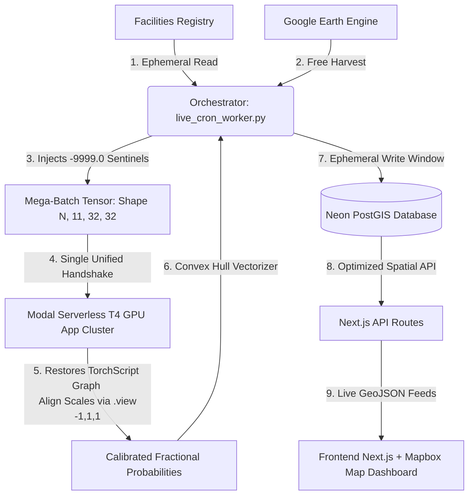

# MethaneLeak

An autonomous, end-to-end Geospatial MLOps pipeline and interactive web dashboard designed for real-time detection, vectorization, and visualization of industrial methane point-source plumes across infrastructure facilities.



## 🚀 Key Architectural Optimizations

* **Cost-Minimized Mega-Batching:** Rather than initiating expensive sequential network handshakes for every data point, the orchestrator aggregates data across all facility targets and dates locally for free. It triggers the serverless cloud GPU **exactly once** per orchestration window, evaluating inputs simultaneously in parallel VRAM for fractions of a penny.
* **Data Publication Lag Resilience:** Protects execution tracks from telemetry walls and empty band states (such as delayed ERA5 hourly wind grids) by using JSON-compliant numeric sentinels (`-9999.0`), which map smoothly back to true float `NaN` variables immediately upon reaching GPU memory.
* **Connection-Insulated Persistence:** Eliminates serverless socket dropping or idle connection timeouts by decoupling compute cycles from database lifecycles. It utilizes separate, short-lived ephemeral connection pools to Neon PostGIS strictly for initial configuration loading and final rapid-fire alerts logging.

---

## 🧠 Model Core & Training Regime

The inference core deployed on the serverless Modal GPU infrastructure relies on a lightweight deep learning architecture discovered and optimized via automated machine learning.

### 1. NAS Selection: Multi-Branch Convolutional Neural Network (CNN)

During the Neural Architecture Search (NAS) execution loop, the search space evaluated a broad spectrum of state-of-the-art computer vision models—including heavy, parameter-dense backbones like MobileNetV2 and the transformer-based Convolutional Vision Transformer (CvT).

The NAS engine **strongly favored a specialized multi-branch Convolutional Neural Network (CNN)** over larger models, choosing it as the absolute best backbone by a massive margin. While transformers and deep sequential networks frequently overfit on multi-modal satellite data grids with sparse labels, the custom multi-branch CNN layout excelled at isolating spatial plume contours while maintaining superior parameters efficiency.

### 2. Early-Fusion Input Structure

The model processes an incoming 4D tensor matrix of shape $(B, 11, 32, 32)$, fusing spatial remote sensing arrays with atmospheric physics channels directly in the stem layer:

* **Channels 1–4 (Gas Diagnostics):** Raw column-averaged dry air mixing ratios of methane ($X\text{CH}_4$) from TROPOMI, alongside target-gas enhancement profiles and pixel QA filters.
* **Channels 5–6 (Kinematic Constraints):** ERA5 $U$ and $V$ wind vectors to help the network differentiate linear, wind-drifted plume morphology from omnidirectional sensor noise.
* **Channels 7–11 (Surface Proxies):** Surface pressure, geopotential heights, and SWIR albedo boundaries to reject high-reflectance false positives like water bodies or mineral flats.

### 3. Training Paradigm & Loss Optimization

* **Weakly Supervised Classification:** Trained to execute binary patch classification (Plume vs. Clean Background). Target masks were constructed by mapping sparse, high-resolution point-source events (from hyperspectral PRISMA and aircraft flyovers) down to coarse TROPOMI grid coordinates.
* **Class Imbalance Mitigation:** Because true methane plumes are highly sparse anomalies in vast background grids, standard cross-entropy easily causes weight saturation. The network was trained using **Focal Loss** to automatically down-weight the loss contributions of easy-to-classify "clean sky" patches and force gradient descent to prioritize ambiguous plume perimeters:

$$FL(p_t) = -\alpha_t (1 - p_t)^\gamma \log(p_t)$$


* **Online Alignment:** Localized Z-score normalization arrays (`train_mean.pt` and `train_std.pt`) are embedded directly into the TorchScript forward pass execution graph, transforming mismatched raw units (ppb mixing ratios vs. hPa pressures) into standard normal distributions on the fly inside VRAM.

---

## 📂 Repository Architecture

```text
├── app/
│   ├── api/
│   │   ├── facilities/route.ts      # Serves infrastructure targets as a GeoJSON FeatureCollection
│   │   └── methane-data/route.js    # Serves verified plume alerts as a GeoJSON FeatureCollection
│   ├── layout.js                    # Global layout configuration and Mapbox CSS ingestion
│   └── page.js                      # Core analytical layout, map shell, and filter controls sidebar
├── components/
│   ├── MethaneMap.js                # Core Mapbox GL wrapper with optimized vector data layers
│   └── FacilityMap.tsx              # React-Leaflet marker component for asset indexing
├── data/                            # Static asset coordinate files and GeoPackage boundaries
├── .github/workflows/
│   └── daily_inference.yml          # GitHub Actions scheduled headless workflow (Runs 02:00 UTC)
├── live_cron_worker.py              # Main orchestrator (GEE extraction, stacking, write manager)
└── modal_inference.py               # Serverless PyTorch JIT model worker on Modal GPU infrastructure

```

---

## 💡 Operational Mechanics & Production Behaviors

* **Observation Filter Rule:** To maximize render speeds, the live map interface hides plumes by default upon initial page load. You must select an explicit **Observation Year** in the dashboard control sidebar to paint vector plumes across the active layer stack.
* **Plume Shape Tracing:** Confirmed model alerts trigger a local spatial Convex Hull vectorizer. This wraps a geometric polygon boundary tightly around the anomalous mixing ratio pixels, storing coordinates cleanly inside the PostGIS layer.
* **Clipboard Integration:** Clicking any asset target on the interactive map copies the precise coordinates `(Latitude, Longitude)` directly into your system clipboard while presenting a client-side toast confirmation window.
* **Global Style Integrity:** To guarantee vector features draw correctly, Mapbox styles are loaded globally inside `app/layout.js`. Modifying or isolating component CSS scopes may disrupt map layer scaling.

---

## 🤝 Acknowledgments & Citation

This pipeline incorporates and implements the core architectures, data processing frameworks, and remote sensing fusion methodologies pioneered by the **ADA Research Group** and climate scientists at SRON.

If you use or build upon this codebase, please attribute credit to the original authors of the **AutoMergeNet** framework:

> J. Wąsala, J. D. Maasakkers, B. J. Schuit, G. Leguijt, I. Aben, R. Schneider, H. Hoos, and M. Baratchi, **"AutoMergeNet: AutoML-based M-Source Satellite Data Fusion Evaluated with Atmospheric Case Studies,"** *IEEE Journal of Selected Topics in Applied Earth Observations and Remote Sensing*, 2025.

---

## 📄 License

This platform is open-source software licensed under the [MIT License](https://www.google.com/search?q=LICENSE).
